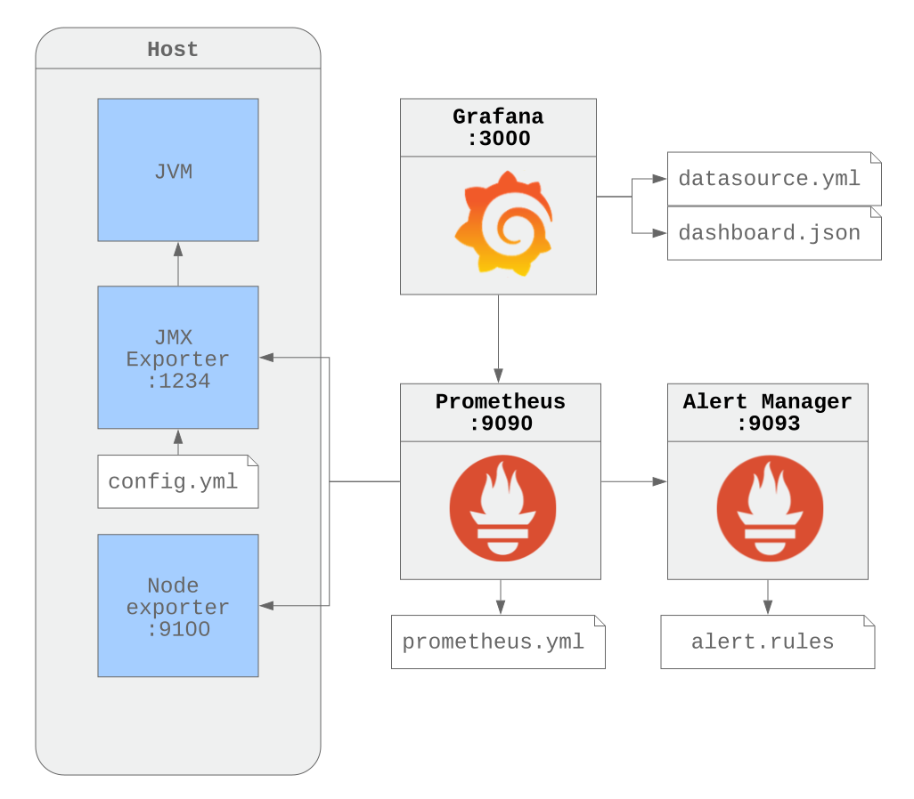
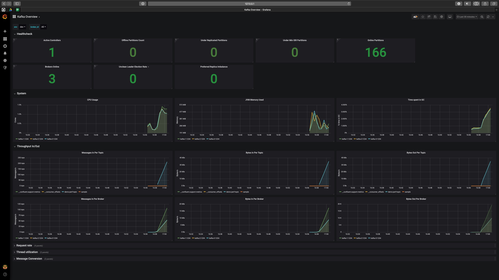
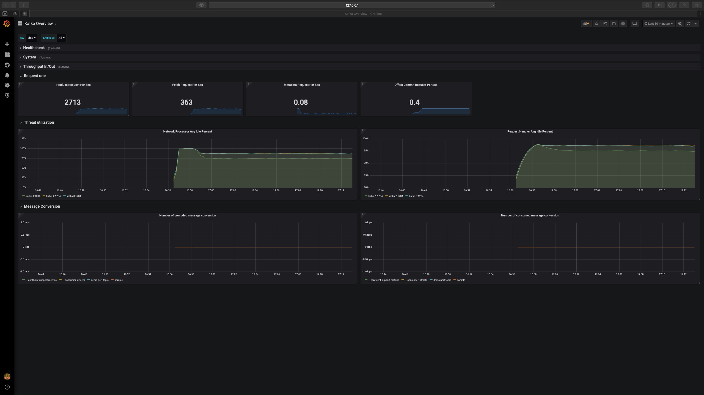
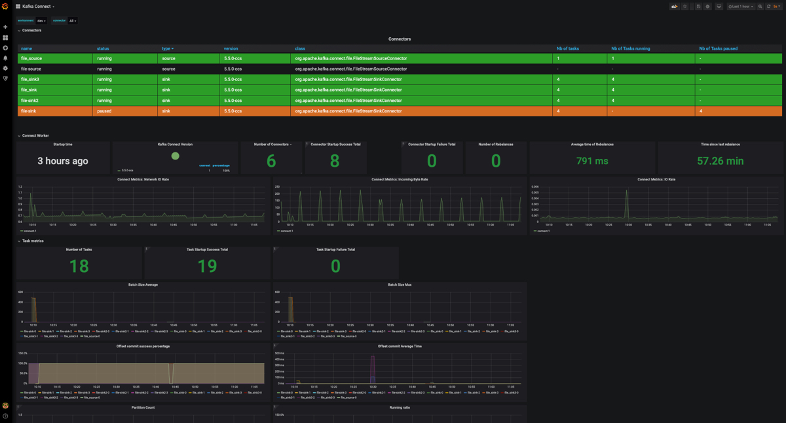

# kafka-platform-prometheus

Simple demo of how to monitor Kafka Platform using Prometheus and Grafana.

# Prerequisites

You need to have docker and docker-compose installed.

# Getting started

```bash
git clone https://github.com/jeanlouisboudart/kafka-platform-prometheus.git
cd kafka-platform-prometheus
```

# Build local images
This repository contains some local docker images including :
* jmx_exporter
* a simple producer
* as simple consumer

To build all images you just need to run :

```bash
docker-compose build
```

# Start the environment
To start the environment simply run the following command
```bash
docker-compose up -d
```

Open a brower and visit http://localhost:3000 (grafana).
Login/password is admin/admin.

# Destroy the environment
To destroy the environment simply run the following command to destroy containers and associated volumes :
```bash
docker-compose down -v
```

# Advanced

## Create a topic

Create `demo-perf-topic` with 4 partitions and 3 replicas.

```bash
docker-compose exec kafka-1 bash -c 'KAFKA_OPTS="" kafka-topics --create --partitions 4 --replication-factor 3 --topic demo-perf-topic --zookeeper zookeeper-1:2181'
```

## Produces random messages

Open a new terminal window and generate random messages to simulate producer load.

```bash
docker-compose exec kafka-1 bash -c 'KAFKA_OPTS="" kafka-producer-perf-test --throughput 500 --num-records 100000000 --topic demo-perf-topic --record-size 100 --producer-props bootstrap.servers=kafka-1:9092'
```

## Consumes random messages

Open a new terminal window and generate random messages to simulate consumer load.

```bash
docker-compose exec kafka-1 bash -c 'KAFKA_OPTS="" kafka-consumer-perf-test --messages 100000000 --threads 1 --topic demo-perf-topic --broker-list kafka-1:9092 --timeout 60000'
```

## Create a sink connector

```bash
docker-compose exec connect \
     curl -X PUT \
     -H "Content-Type: application/json" \
     --data '{
            "connector.class":"org.apache.kafka.connect.file.FileStreamSinkConnector",
            "tasks.max":"4",
            "file": "/tmp/test.sink.txt",
            "topics": "demo-perf-topic"
}' \
     http://localhost:8083/connectors/file-sink/config | jq .
```

Verify that data is written to file `/tmp/test.sink.txt`:

```bash
docker-compose exec connect bash -c 'tail -10 /tmp/test.sink.txt'
```

## Create a topic

Create `demo-perf-topic-copy` with 4 partitions and 3 replicas.

```bash
docker-compose exec kafka-1 bash -c 'KAFKA_OPTS="" kafka-topics --create --partitions 4 --replication-factor 3 --topic demo-perf-topic-copy --zookeeper zookeeper-1:2181'
```

## Create a source connector

```bash
docker-compose exec connect \
     curl -X PUT \
     -H "Content-Type: application/json" \
     --data '{
            "connector.class":"org.apache.kafka.connect.file.FileStreamSourceConnector",
            "tasks.max":"1",
            "file": "/tmp/test.sink.txt",
            "topic": "demo-perf-topic-copy"
}' \
     http://localhost:8083/connectors/file-source/config | jq .
```

Verify that data is written in kafka topic `demo-perf-topic-copy`:

```bash
docker-compose exec kafka-1 bash -c 'KAFKA_OPTS="" kafka-console-consumer -bootstrap-server kafka-1:9092 --topic demo-perf-topic-copy --from-beginning --max-messages 10'
```


## Setup



## Dashboards


### Kafka Dashboard






### Producer Dashboard


### Consumer Dashboard


### Consumer Lag Dashboard

This is using [kafka-lag-exporter](https://github.com/lightbend/kafka-lag-exporter) in order to pull consumer lags metrics from kafka cluster and be exported to Prometheus.


### Connect Dashboard


