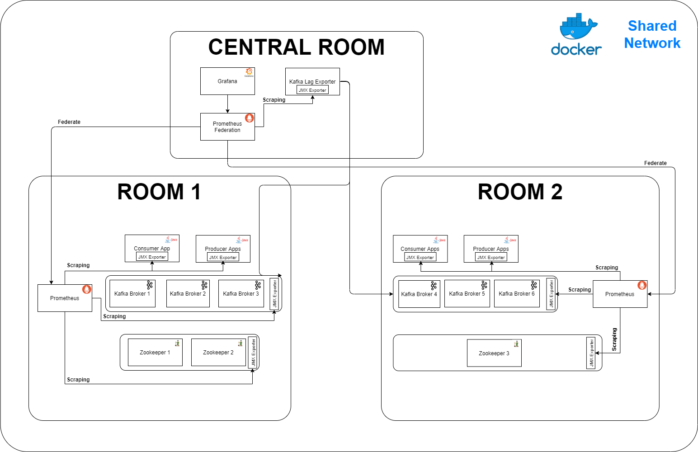

# Prometheus federation

Simple demo of how monitor strech Kafka platform in multiple datacenter using Prometheus and Grafana.



# Prerequisites

You need to have docker and docker-compose installed.

# Start the environment

You have create a docker network attachable to permit commnication between containers.
``` bash
docker network create --attachable network-federate
```

Deploy room1 (3 Brokers, 2 Zookeepers, 1 Prometheus server, 1 Producer App & 1 Consumer App)
``` bash
docker-compose -f docker-compose-room1.yml up -d
```

Deploy room2 (3 Brokers, 1 Zookeeper, 1 Prometheus server, 1 Producer App & 1 Consumer App)
``` bash
docker-compose -f docker-compose-room2.yml up -d
```

Deploy central which contains 1 Grafana, 1 Kafka Lag exporter and 1 Prometheus server in federation mode
``` bash
docker-compose -f docker-compose-central.yml up -d
``` 

Open a brower and visit http://localhost:3000 (grafana).

Login/password is admin/admin.

# Destroy the environment

Destroy room 2
``` bash
docker-compose -f docker-compose-room2.yml down -v
```

Destroy room1
``` bash
docker-compose -f docker-compose-room1.yml down -v
```

Destroy central
```
docker-compose -f docker-compose-central.yml down -v
```

Delete shared network docker
``` bash
docker network rm network-federate
```